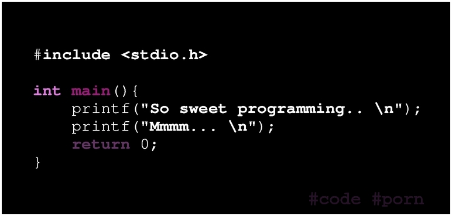

This tool convert small .c file to sweet jpg image.  
Max size is 90 cols x 66 rows.   
Like this:



Install:  
```
sudo aptitude install enscript ghostscript imagemagick
mkdir ~/.enscript
cp style_a1is.st ~/.enscript/ 
```

Usage: ` ./code-porn example.c `  
Produce ` example.c.jpg `
